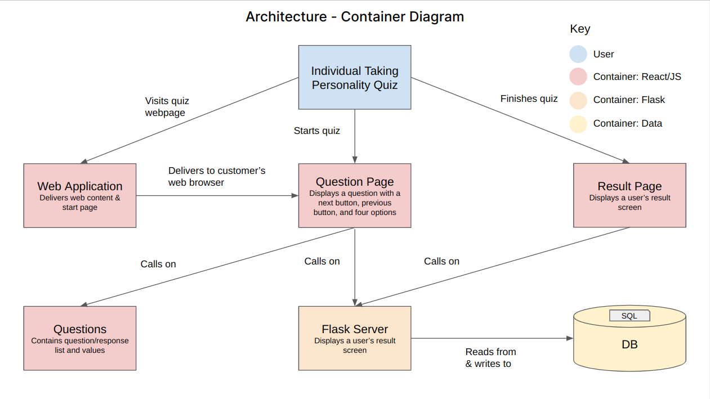
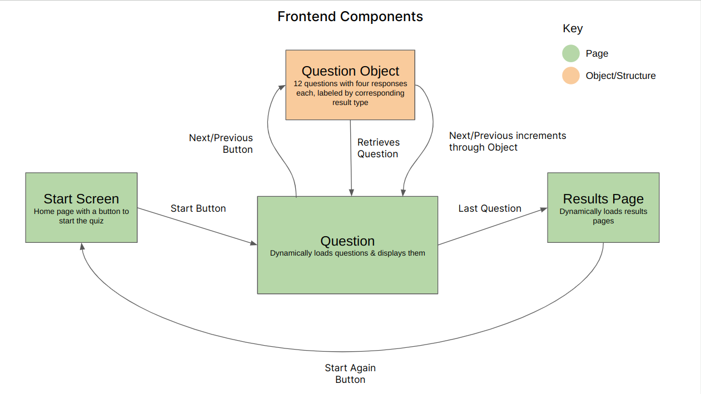
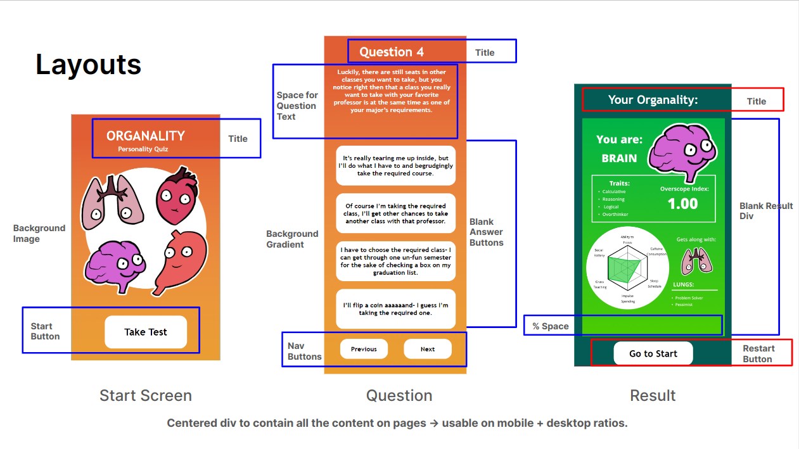
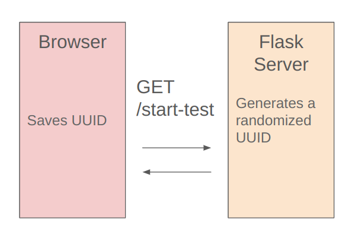
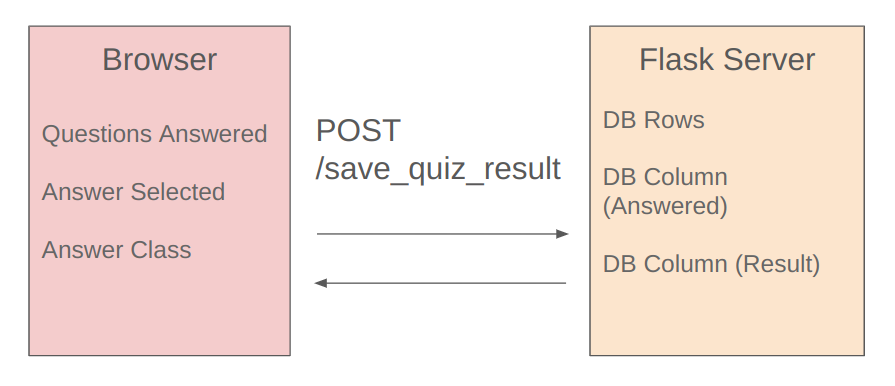
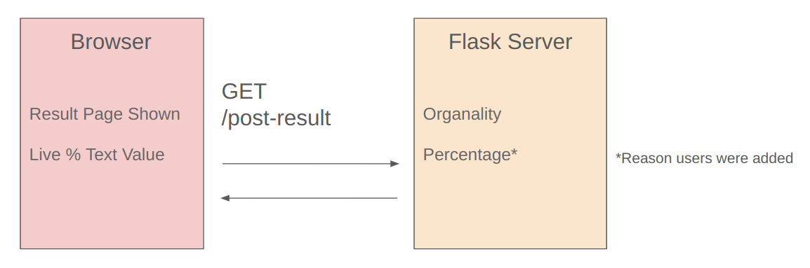

# Personality Quiz Site
Aditi Vinod & Sela Domkofski

A website with a fun personality quiz that provides characters & some key characteristics as a result.
- 12 questions
- 4 outcomes
- Next & previous buttons on each question page
- Compares outcome to other users
## Challenges
- Laying out graphics over the background.
- Creating and updating a SQL database through a front end while maintaining certain constraints (ex: each question should only be added once, storing the answered status of questions, and calculating final results.
- Figuring out how to properly debug the backend-frontend interactions when values were the wrong type or not being sent correctly.
- Creating and passing userIDs through the personality quiz; generating a new userID upon restarting the quiz.
- Calculating the percentage of users with the same result as the current user. 
## Usage
### Dependencies
- [React](https://react.dev/)
- [Flask](https://flask.palletsprojects.com/en/3.0.x/)
### Installation Prerequisites
- `pip install Flask`
- `pip install -U Flask-SQLAlchemy`
  
In frontend directory (`personality-site`)
- `npm install`
- `npm install react-router-dom`
- `npm install axios`
- `npm run build`

In backend directory (`flask-server`)
- `python3 -m venv venv`
- `source venv/bin/activate`
### Available Scripts
`cd` into `flask-server`, then run `python server.py` - Hosts a Flask app
locally so the React app can make API calls.

`npm start` - Runs the app in development mode. \
Open [http://localhost:3000](http://localhost:3000) to view it in a browser; the
page will reload on changes.
## Architecture
### Container Diagram

### Frontend
#### Components

UserID is set on rendering the start screen and is passed through the next pages by adding to the URL (ex: `/question?userID=${userID}`).

#### Layouts

### Backend
#### Creating a User

#### Database Structure
| ID | Question Number | Result | Answered | Organality |
| ------------------------------------ | - | ------- | - | ------- |
| dfceb961-bca8-47d0-ae9d-7a5316b9f290 | 1 | stomach | 1 | stomach |

SQL database with 1 example row depicted. "Organality" is the result class that a single user recieves.
#### Saving Quiz Information

#### Result Navigation

"Percentage" is the % of users with the result class as the current user, calculated each time around.

